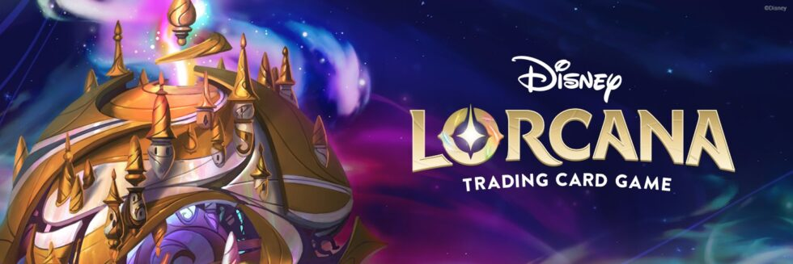

### Multiplatform Lorcana Manager APP & API

# Join the Discord community

Join us by [clicking here](https://discord.gg/JsABX9CvcU)

# Backend available for your projects

An effortless backend implementation to provide access to cards and their data

# Front end

A Kotlin Multiplatform implementation is available for :

- Android
- iOS
- JVM (Windows, Linux, MacOS)
- JS (WIP)

# Shared implementation

The cards are available in assets/data and are bundled inside the shared project available for use by both the server & apps

# Usage

## Requirements

- Android Studio
- Java

## Development

It will be refactored but the apps exists alongside "app-ui" which exists solely to fix an Android Studio "issue". To use compose multiplatform, only android or desktop are supported for preview so this project is only referring to the commonMain folder as androidMain.

## Roadmap

- upgrade backend code
- add actual UI content
- update documentation
- Lore counter & Deck management

# Resources

Some svg assets are from https://github.com/glimmerdb/lorcana-icons credits to @GlimmerDB and specifically nateofthecards (https://www.behance.net/89c6305f)
